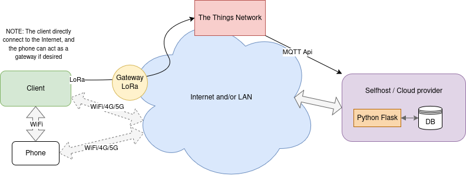

# IoT Platform

## Description
This project aims at creating a platform for collecting and sending vehicule's data using the mobile network or LoRa. It is divided in two main components: the server (composed of a web server, a web app and a database) and the client (running on an embedded system, also called a device, connected to sensors).
Both the server and client are written in Python.
We also provide a Android app allowing a phone to be used as a sensor by the client (for GPS, acceleration, etc).

## Main features
- Data collection with an embedded system and external sensors
- Cooperative Perception*: systems can signal obstacles, and others can query for nearby obstacles
- Data transmission to a server using mobile network (via HTTP or WebSockets) or LoRa
- Live data visualization through a web app.
- Data access API
- Benchmarking & measures: the platform measure all sorts of things about itself and its performance, like network usage, latency and reliability

## Networking
The program is designed to either use the internet connection available on the host device if running on HTTP/WebSocket, as well as LoRa using a Lopy 4 wireless module connected via UART.
The client allows for two networks to be used: one main and a backup/alternative. If the main network is down*, the client switches to the backup. In case both networks are down, the data is still being logged localy. When a network is down, we periodicaly check if its back up and switch accordingly.

* NOTE: LoRa doesn't provide an easy way to know if the network is up, as we would need to use confirmed messages, which are limited in number because they require downlink communication. We assume that LoRa is always up, as a "best effort" backup solution.

* NOTE: HTTP and WebSocket count as two different networks

For static devices, LoRa could would be suitable for infrequent status update, while a more capable network could be used for important, real-time data.

Because the program was at first designed with HTTP/LoRa in mind, for now client needs to poll the platform to receive updates about their surroundings. But with Websocket now being implemented, we could change this schema to have the server pushing updates to client instead, potentially allowing for less bandwith wasted and lower latency, at the cost of an increased workload for the server (but all the polling also has a cost server-side so could even reduce the workload ?)

## Setup & Usage
This section contains information on how to setup, deploy and use both the software and the hardware.

### Hardware
See [hardware.md](doc/client_hardware.md) for more information about the hardware we used.

### Client
See [client.md](doc/client.md.md) for information on how to setup, configure and debug the client software.

### Server
See [server.md](doc/server.md) for information about the server's software, how to install, configure and run it.

## Benchmarking
- Client: 
    - measures the Network latency when sending data via http (from client to server), when pulling data from the server via http and websocket (total round-trip time of the request)
    - measures the total latency from the observation to another device receiving the information
    - The client measures the percentage of succes of a network rx/tx (i.e packet loss) (Not supported by all networking options)
- Platform: 
    - measures the network delay for all type of messages, and saves it in the database for device update messages (`netDelay` column in the database)
    - packet loss for each device (total packet loss, combination of all networks* and for all messages), and logged in the device data (total number of lost packets between two successful device update messages) (`packetLoss` column in the database)

NOTE: We use a message number (modulo 256) to detect package loss. If multiple network are used simultaneously, packets may arrive out-of-order and would be counted as packet-loss, even though they have been received and processed.

NOTE: We use timestamps to measure network delays, so _make sure all your devices have synchronized clocks_

## Details

### Sessions
The server uses a database for long-term storage, but also uses an intern cache. This cache as a default duration of 10 minutes (but this can be configured). This creates an implicit notion of "session", as many features of the platform will only use the data cache. 
For example, the platform will measure network packet loss while the device is in cache. So if a device is offline longer than the cache duration, once it reconnects the statistics would have been removed. 
Because the cache is only purged when inserting new data, if there is only one device, the new data upon reconnection will be inserted before the purge, so the session will continue.
This cache is *not saved when stopping the server*.
The 'Visualize' page also pulls data from the cache if the selected duration is shorter than the cache duration. This means, however, that if the platform was recently restarted, selecting a duration shorter than the cache size will return no data, as they are expected to be in cache, while the data is actually available in the databse (see Improvement 8)

### Android Application
The provided Android app is used to gather data from the smartphone's sensors (GPS location, orientation data) and send them to the client. 

## Possible Improvements:
1. ~~Redo device edit/list page to show lora eui if present~~ DONE (31008e87991f8ac9bcb3403117db5f9f2508782d)
2. Multiple LoRa message structure for different devices (for now they must all use the same) UPDATE: can be done quite easily by editing the common/lora functions server side to take the deviceid, and provide a list of format.
3. As of now, clients are polling to API to retrieve le list of nearby objects reported by other devices. This could be improved by using a messaging system, so clients only receive the necessary information without polling (would improve latency and network usage)
4. ~~Provide a way to configure a client/device as a stationnary equipement, removing the need for a GPS~~ DONE (7e3b40cd3bfc5fb7e548b04d559a451b1b762fdd)
5. ~~Live Data persistence: device live data are removed from cache after 1 hour, objects are stored in cache until the app is stopped.~~ DONE (bb2eff6fbd39b616300e1c3c1c5d836a7ba44d3e)
6. Re-use more code between to WUI and the API (in progress)
7. Create sub-categories of messages for various level or importance, and select which network to use
8. Merge cache and database sources for data visualisation
9. WebSocket: push data updates, instead of polling