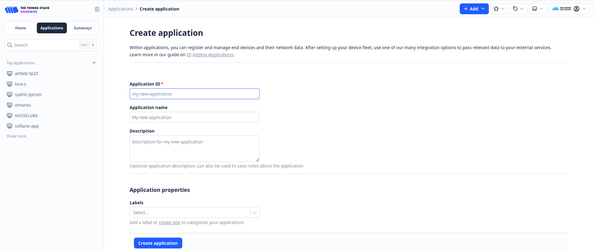
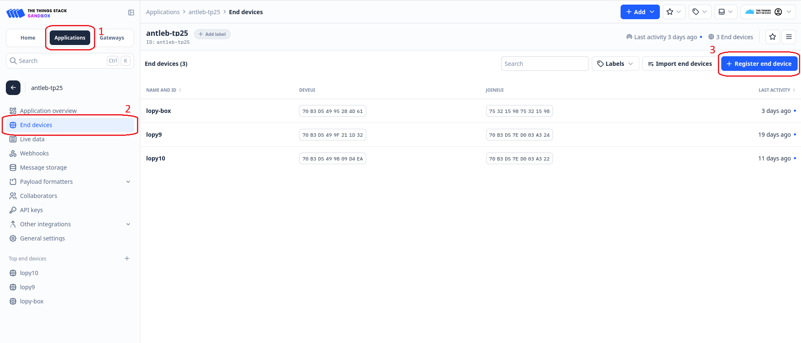
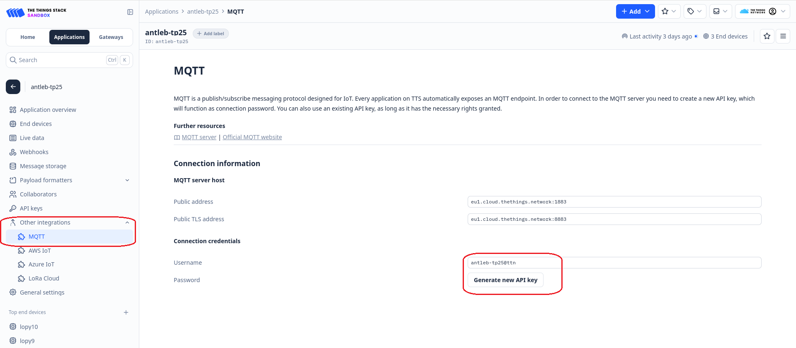

# LoRaWAN and The Things Network
This page documents how to create an application on The Things Network and how to connect the platform to The Things Network using their MQTT API.

## Create an Application
- choose an application ID, for example `iot-platform`
- 

## Register LoRa devices
Once you created your application, register your devices in .
- 

## MQTT Api Integration 
Under `Other Integrations`, `MQTT` copy the Username and press `Generate new API Key`. 
Put these values in the server's `config.conf` file in the `APP_username` and `APP_password` fields.

- 